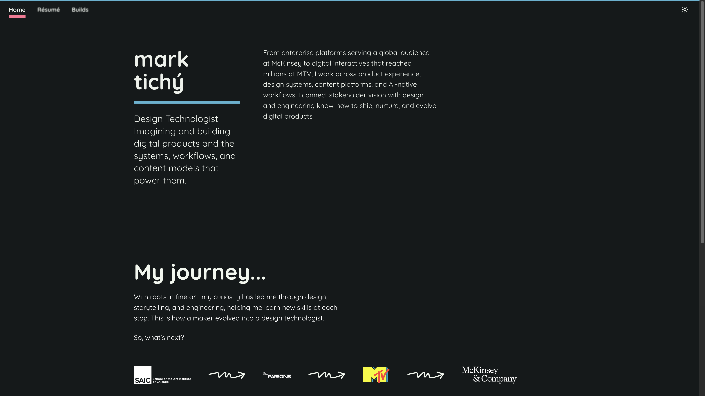

# Mark Tichý — Portfolio Site

Personal portfolio and résumé site for [Mark Tichý](https://v0-tichy-hq.vercel.app), a Design Technologist. The live site is the primary deliverable; this repo is part of the application — intended to be read by hiring managers and engineers, not just browsed.

**Live site:** [v0-tichy-hq.vercel.app](https://v0-tichy-hq.vercel.app)



## What's here

| Route     | Purpose                                                   |
| --------- | --------------------------------------------------------- |
| `/`       | Home — intro, bio, career journey                         |
| `/resume` | Full résumé with downloadable PDF                         |
| `/builds` | Process write-up for how this site was designed and built |

## Stack

- **Framework:** [Next.js 16](https://nextjs.org) (App Router, Turbopack)
- **UI:** [React 19](https://react.dev), [TypeScript](https://www.typescriptlang.org) (`strict: true`)
- **Styling:** [Tailwind CSS 4](https://tailwindcss.com), design tokens in `app/globals.css`
- **Components:** [shadcn/ui](https://ui.shadcn.com) (Base UI primitives), [next-themes](https://github.com/pacocoursey/next-themes) for light/dark mode
- **Analytics:** [@vercel/analytics](https://vercel.com/docs/analytics) (production only)
- **Deploy:** [Vercel](https://vercel.com) — auto-deploy on push to `main`

No environment variables are required to run or build the site locally.

## Getting started

**Prerequisites:** [Node.js](https://nodejs.org) 18+ and [pnpm](https://pnpm.io)

```bash
git clone https://github.com/mtichy/tichy-hq-site.git
cd tichy-hq-site
pnpm install
pnpm dev
```

Open [http://localhost:3000](http://localhost:3000).

### Other scripts

```bash
pnpm build   # production build
pnpm start   # serve production build locally
pnpm lint          # ESLint (Next.js core-web-vitals + TypeScript)
pnpm format:check  # Prettier formatting check
pnpm format        # Prettier auto-format
```

## Project structure

```
app/                  # Next.js App Router pages and global styles
  layout.tsx          # Root layout, metadata, theme provider
  page.tsx            # Home
  resume/page.tsx
  builds/page.tsx
  globals.css         # Design tokens (color, type scale, spacing)
components/           # UI components (mostly server components)
  ui/                 # shadcn/ui primitives
lib/
  site.ts             # Site URL, default metadata, OG image config
  utils.ts            # Tailwind class merge helper
public/               # Static assets (favicons, logos, résumé PDF)
docs/                 # README assets (screenshots)
```

## Design system

Typography, color, and spacing are defined as CSS custom properties in `app/globals.css`, exported from a Figma design system before any code generation. Semantic tokens map primitives to light and dark themes (for example `--background`, `--foreground`, `--accent`).

The `/builds` page documents the full workflow: Figma tokens → v0 prototyping → GitHub → Cursor refinement → Vercel deployment.

## Configuration

Site-wide metadata lives in `lib/site.ts`:

- Production URL (`metadataBase`)
- Default title and description
- Open Graph / Twitter card defaults

Update `siteUrl` in that file when a custom domain is added.

## Deployment

The repo is connected to Vercel. Every push to `main` triggers a production deploy; branches and pull requests get preview URLs.

Production URL: **https://v0-tichy-hq.vercel.app**

## Notes for reviewers

- **TypeScript:** `strict` mode is enabled in `tsconfig.json`. No `any` types in source.
- **Client JS:** Minimal `"use client"` usage — theme provider and theme toggle only; NavBar is a server component with per-page `activePath`.
- **Accessibility:** Semantic landmarks (`header`, `nav`, `main`, `footer`), `aria-current` on nav links, focus-visible styles on interactive elements, alt text on images.
- **Secrets:** No API keys or `.env` files in the repo. `.gitignore` excludes `.env*`, `node_modules`, and `.next`.
- **Static output:** All routes pre-render as static HTML at build time.

## License

Private — all rights reserved.
